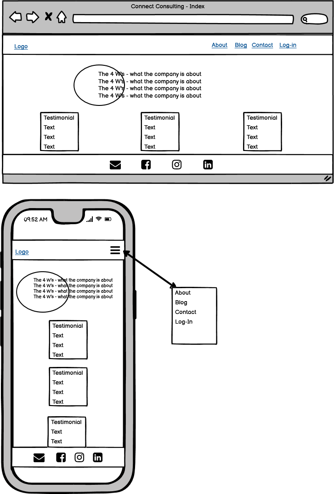
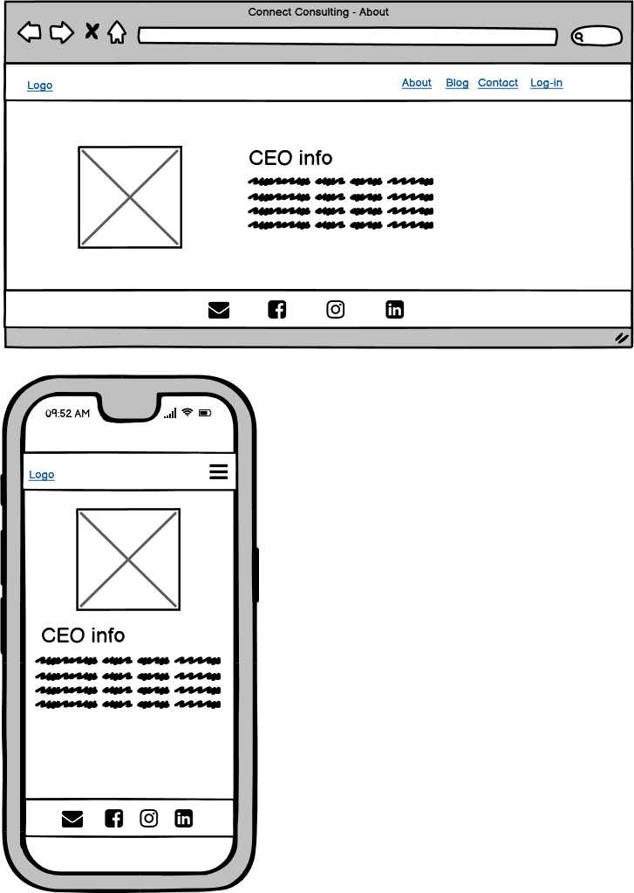
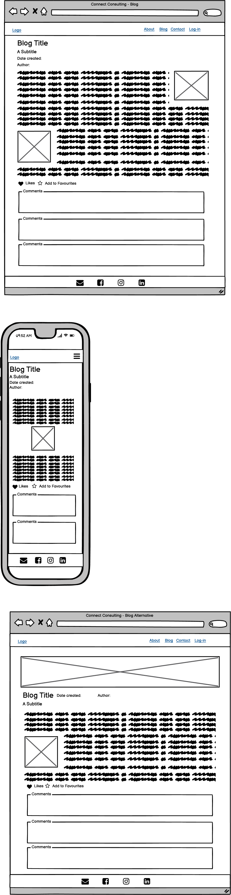
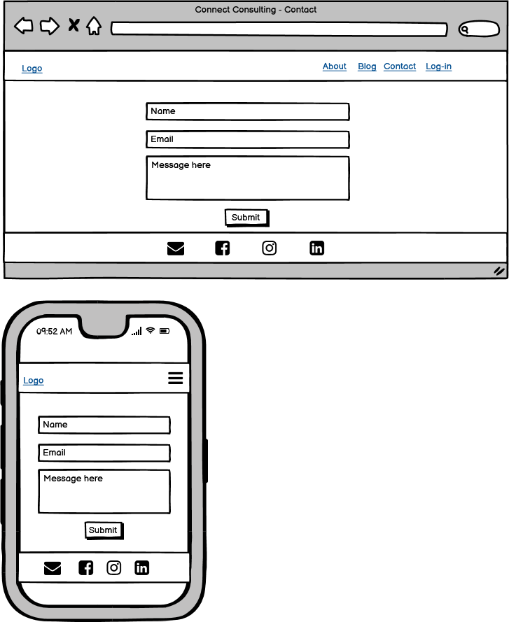
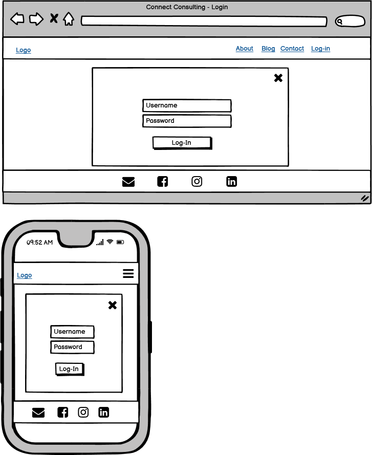
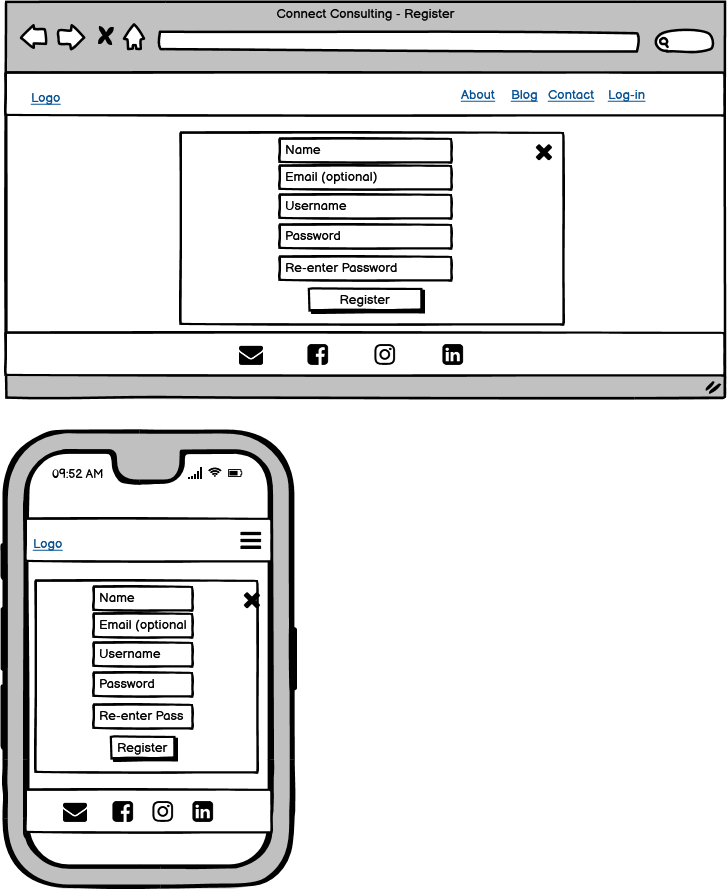
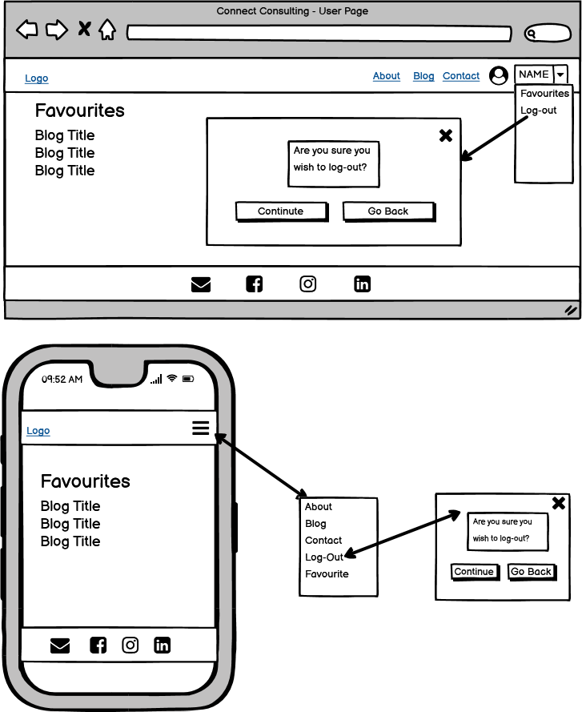
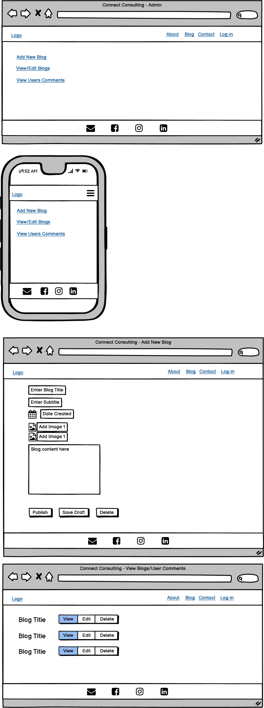

# Connect Consulting

For my **Portfolio 4 Project** on the **Code Institute's Diploma in Software Development (E-commerce Applications)** course I have created a Blog Website for a consulting Company called Connect Consulting.  

Connecting Consulting is a Consulting Company that can help clients identify their business issues, develop solutions and take remedial action.  It’s main objective is to create a meaningful impact in the lives of their clients.  What sets Connect Consulting apart is their genuine passion for helping others.  Connect Consulting connect the dots of business through people.

The website is created almost like a Wordpress Blog website where the user can create, view, edit and delete blogs on the frontend making it easier on the client and it saves on yearly subscription fees.

Link to the deployed app is [here](https://connect-consultingp4.herokuapp.com/).

-----

## Objective?

-----

The main objective is to create an interactive website that the owner as a user can engage with via an admin login system to access a database.   The website is created like a Wordpress Blog website where the user can create, view, edit and delete blogs on the frontend making it easier on the client and it saves on yearly subscription fees.   Users other than admin can login, leave comments and testimonials and read information for the blog that the owner has created, thus helping them which is the object of Connect Consulting.

## User Experience

Site Aims
1. To create a website to allow the owner to create, update and delete blogs.
1. To allow the owner/user to create, view and approve testimonials.
1. To allow the owner/user to view or delete messages from other users.
1. To allow the owner to view, approve or delete message from other users.
1. To allow users to view information about the company and the service they provide.
1. To allow users view blogs.
1. To allow users to leave comments on blogs.
1. To allow users to like a blog.

### From a User's Perspective
As a user it is important:

### Users Fulfilment

-----
## UX 

### Existing Features

Home

Home
 

-----
## Technologies Used 

- [HTML5](https://en.wikipedia.org/wiki/HTML5) to provide content and structure to the website.
- [CSS3](https://en.wikipedia.org/wiki/CSS) provides styles for the website.
- [Python](https://www.python.org/) to provide functionality to the website. 
- [a11y](https://color.a11y.com/Contrast/) to test contrast. 
- [TinyPNG](https://tinypng.com/) to compress images.
- [Cloudinary](https://cloudinary.com/) to store images. 
- [GitPod](https://www.gitpod.io/) to create and edit the website. 
- [GitHub](https://github.com/) to host website
- [GitBash](https://www.atlassian.com/git/tutorials/git-bash#:~:text=What%20is%20Git%20Bash%3F,operating%20system%20through%20written%20commands.) to push changes to GitHub.
- [Heroku](https://id.heroku.com/login) to deploy the website. 
- [Balsamiq](https://balsamiq.com/) to create wireframes. 
- [Draw.io](https://drawio-app.com/) to create logic flow chart. 
- [vsCode](https://code.visualstudio.com/) to create logic flow chart.
- [Google-Sheets](https://www.google.com/sheets/about/) to store username and scores. 
- [Google Chrome Dev Tools](https://developer.chrome.com/docs/devtools/) to debug and test responsiveness.

-----
## Resources 

- [Code Institute](https://codeinstitute.net/ie/) for course materials, tutor and mentor support, in particular the use of google sheets and deployment to heroku.
- [Slack](https://slack.com/intl/en-ie/) in particular the Code Institute Slack Community.
- [W3schools](https://www.w3schools.com/) 
- [Pexels](https://www.pexels.com/) images. 

## Python Libraries/Modules/API

-----
## Testing

### User Testing

### Manual Testing

### Validators 

Python files were tested using [Pep8 Validation](http://pep8online.com/checkresult). 

file to  Validation
 

 

###  Result: Chrome Lighthouse 

I used Chrome Lighthouse to test Performance on the website. 

Lighthouse Validation
 

 

### Color Contrast Testing 

I used [a11y](https://https://color.a11y.com/) to test the color contrast on the website

Color Contrast 
 

 

### Issues/Bugs Fixed 

**Heading**

Content 

Error

 

-----
## Version Control

### Git and GitHub 

Local repository and IDE used: GitPod
Remote repository used: GitHub

Steps followed: 
- I created a new public repository on GitHub using the Code Institute template.
- I then created a workspace and started coding on GitPod. 
- All relevant files were created. 
- To save my work safely I continued to use the terminal consistently by using: 
    - **git add .** to add work to git
    - **git commit -m""** to commit the work 
    - **git push** to update work to GitHub 

### Deployment to Heroku

The website was deployed to heroku by doing the following: 

1. Navigate to [heroku](https://id.heroku.com/login). 

2. Click "new" and create a new App. 

  

  
New App

  

  

   

3. Give your app a name, choose your region and Click "Create app". 

  

  
Name and Create

   
  

  

4. The menus that we are concerned with are "Deploy" and "Settings".  Click on "Settings" First. 

  

  
Settings

   
  

  

5. Copy the contents of the creds.json file.  Insert "CREDS" into the key field and the entire contents of the file into the value field.  The template code provided will use this information to create the file called creds.json and write this data into it as the application is built. 

  

  
Convig vars

   
  

  

6. Buildpacks now need to be added.  These install future dependancies that we need outside of the requirements file.   The first is python and the second is node.js.  Select Python first and then node.js and click save.  Make sure they are in this order.

  

  
Buildpacks

   
  

  

7. Then go to the deploy section and choose your deployment method.  To connect with github select github and confirm. 

  

  
Connect to github

   
  

  

8. Search for your repo, select it and click connect. 

  

  
Repo Search

   
  

  

9. You can choose to either deploy using automatic deploys which means heroku will rebuild the app everytime you push your changes.  For this option choose the branch to deploy and click enable automatic deploys.  This can be changed at a later date to manual.  Manual deployment deploys the current state of a branch.  

  

  
Manual Deployment

   
  

  

  

  
Automatic Deployment

   
  

  

10. Click deploy branch. 

11. If successful you should be able to view your deployed app by clicking "View". 

  

  
View Deployment

   
  

  

        
    

  ### Fork a Repository: 
        
    A copy can be made of a repository by forking the repository.  The copy can then be viewed and changed without affecting the original repository. 
    
      - From your list of repositories select the repository you want to fork.
      - On the top of the page to the right had side you will see a fork image.  Click on the button to create a copy. 

      
  

Fork Preview Image

 

  ### Clone a Repository: 
        
    Cloning this project from GitHub can be done by following these steps: 
    
      - From your list of repositories select the repository you want to deploy.
      - Click on the code tabe. 
      - Click on the clipboard icon to copy the URL.  
      - Open Git Bash in your IDE. 
      - Change the current working directory to the location you want to place the clone. 
      - Type git clone and paste the copied URL.  
      - Press enter for the clone to be created. 

  

Clone Preview Image

 

 

## Credits 

-----
## Acknowledegments/Conclusion

I couldn't complete this without the massive support I get from my Code Institute cohort in particular [Kasia](https://github.com/bezebee), our cohort facilitator.Thanks to my mentor Spencer for being a great support and a really nice guy!

Rachel Rock September 2022
