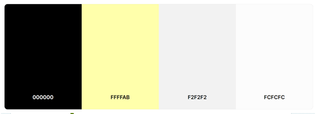
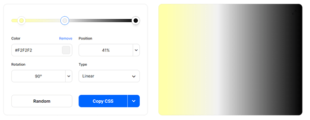
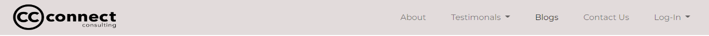
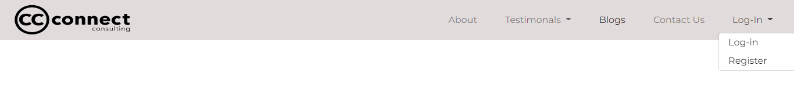
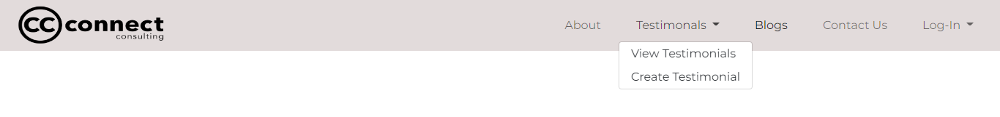
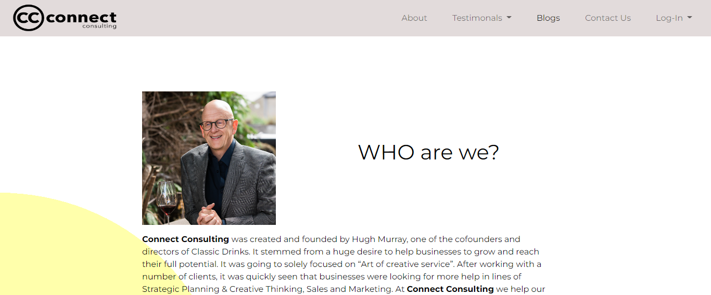
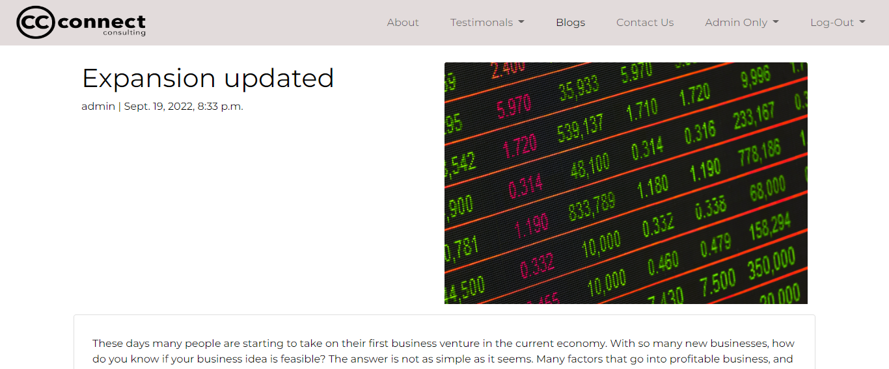
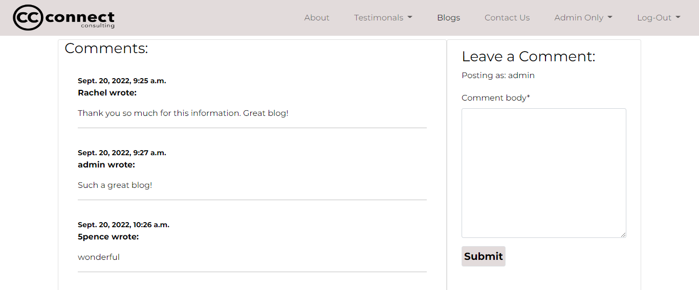

# Connect Consulting

For my **Portfolio 4 Project** on the **Code Institute's Diploma in Software Development (E-commerce Applications)** course I have created a Blog Website for a consulting Company called Connect Consulting.  

Connecting Consulting is a Consulting Company that can help clients identify their business issues, develop solutions and take remedial action.  It’s main objective is to create a meaningful impact in the lives of their clients.  What sets Connect Consulting apart is their genuine passion for helping others.  Connect Consulting connect the dots of business through people.

The website is created almost like a Wordpress Blog website where the user can create, view, edit and delete blogs on the frontend making it easier on the client and it saves on yearly subscription fees.

Link to the deployed app is [here](https://connect-consultingp4.herokuapp.com/).

-----

## Objective?

-----

The main objective is to create an interactive website that the owner as a user can engage with via an admin login system to access a database.   The website is created like a Wordpress Blog website where the user can create, view, edit and delete blogs on the frontend making it easier on the client and it saves on yearly subscription fees.   Users other than admin can login, leave comments and testimonials and read information for the blog that the owner has created, thus helping them which is the object of Connect Consulting.

## User Experience

Site Aims
1. To create a website to allow the owner to create, update and delete blogs.
1. To allow the owner/user to create, view and approve testimonials.
1. To allow the owner/user to view or delete messages from other users.
1. To allow the owner to view, approve or delete message from other users.
1. To allow users to view information about the company and the service they provide.
1. To allow users view blogs.
1. To allow users to leave comments on blogs.
1. To allow users to like a blog.

### Agile Methodology - UX

To plan this project I used agile methodology.  This was done using Github and the Project Board.

By using the Kanban board and in particular Milestones I was able to divide the project into difference epics such as:

1. Development
1. Design
1. Content
1. Authoristation
1. Comments

For better organisation I used both the Table View and Kanban view. The Kanban view meant I could put each issue into a different section, Backlog, In progress, Completed and Wishlist.

Kanban View
 

The table view allowed me to view all of the issues in each section clearly.  

Table View
 

Issues were created by way of User Stories or Admin User Stories and any other elements required to complete the database.  While working on a particular user story they were moved into ‘In progress’.  Once completed they were moved to ‘completed’.  This gave a better view of what was to be completed and what had already been completed.  As work was committed to the github repository each issue was marked completed which automatically moved to the ‘completed’ section on the Kanban Board.

### From a User's Perspective

#### Admin User's Perspective

1. As an Admin User I can login to have access to the admin panel.
1. As an Admin User I can create blogs so that users can read them.
1. As an Admin User I can delete blogs so as to control content on the website.
1. As an Admin User I can amend blogs so as to control content on the website.
1. As an Admin User I can create testimonials so that they can be view by other users.
1. As an Admin User I can view messages left by other users so that I can read them and contact them if needed.
1. As an Admin User I can approve testimonials left by the user so as to control content on the website.
1. As an Admin User I can approve or delete comments left by the user so as to control content on the website.

#### User's Perspective

1. As a user I can register or login to the website so that I can leave comments and testimonials. 
1. As a user I can enter the website and clearly see the purpose of the website and easily navigate the website.
1. As a user I can click ‘About’ and clearly see what the website is about, who owns the company and what the company offers.
1. As a user I can read Testimonials from other users that admin has approved.
1. As a user I can create Testimonials for the company which are then sent for approval.
1. As a user I can view a list of blogs created by the company so that I can choose which blog to read.  
1. As a user I can select the blog I want to view so that I can read information about that blog.
1. As a user I can leave comments on a blog so that I can provide feedback to the owner.
1. As a user I can mark a blog as favourite so that I can provide feedback to the owner.
1. As a user I can fill out a form so that I can contact the owner.
1. As a user I can logout of the website so that I can logout of the website.

## Wireframes

While the site has changed somewhat since the beginning of the project, wireframes were a useful too to visualize the website.  Wireframes below.

Wireframes
 

## Database Schema

## Site Structure 

The website consists of 16 pages.  The main pages are Home, About, Blogs, Testimonials, Contact and the Sign-up pages all of which can be accessed by all users.  Some pages are only visiable when logged in, particularly for the Admin User, such as  #### Update Blog, Delete Blog, Review Testimonials, Approve Testimonials, Review Messages and Delete Messages.  There is a comment and favourite section in the blog which can only be accessed by Admin or Users that are logged in. 

Once a user is logged in the Log-in link on the navigation bar changes to Log-Out.

Once the admin is logged in an Admin Only menu appears on the navigation bar, which only admin can view an access.

## Design

### Colours

The use of colour is to keep this as simple as possible. Clean and clear allowing the content to shine.  The use of a tint of yellow is to symbolise white wine. In future other colours may be added to symbolise red wine.  All colours are used as a gradient for some headers on the testimonials and review messages.

### Typography

Montserrat was the only font used for this website, again to keep the website, clean and simple.

## Features

### Existing Features

#### Navigation

Navigation appears on each page.  The design remains consistent throughout, however the menu options change depending of whether a user or admin user is logged in or out. 

Navigation
 

#### Home Page

This page is the landing page and is the first page that users will see when the site loads.  The page has a logo clearly showing that the website is about hospitalilty specialists.  Information about what the company do is shown on this page. 

Home Page
 

#### Footer

The footer simply directs the user to all social media links. It is consistent throughout the websiste and remains at the bottom of the page. For the purpose of this project the links will open the social media pages but not the companys social media as they are not yet set up. 

#### About

This page gives more information about the CEO of the company and goes into detail of what the company is about.  An image of the CEO is at the top of the page.  I felt it was important to put a face to the company. 

About Page
 

#### Blogs

When you click on the link on the blog page the user is directed to a list of blogs that admin have published.  The user can decide which blog to view by clicking the 'View' button which then opens up a detailed view of the choosen blog.  If an Admin user is logged in they can see two other buttons, one for Editing the Blog and the other for Deleting the Blog.

#### Blog Details

This page will show the blog in detail, such as Title, subtitle, images and blog content.  This page also has a comment section.  If a user is logged in they can comment on posts and like posts.  

Blog Detail
 

#### Testimonials

This page shows a list of testimonials that have been submitted by users.  They are three to a page and you can navigate through the pages easily to view all of the testimonials.

##### Create Testimonials

Users can create testimonials by completing this form.  Once submitted it is sent to admin for approval.  There is no functionality yet for the user to amend the testimonial or delete it.

#### Contact

The contact page allows the user to contact the company without the use of an email system.  The user completes the form and the message will then be saved in the database for admin to view.

#### Admin-Only

Admin only pages are accessed by admin users from the admin dropdown menu.

##### Update Blog

This consists of a form that is already populated with the blog content that the user can update if required.  

##### Delete Blog

Once the admin user clicks on Delete on the Blog List page they are directed to this page where they can either delete the blog or go back to the Blog List page if they change their mind. 

##### Review Testimonials

This page shows the admin user a list of testimonials not yet approved.  It is listed in an accordion so it is neat and easy for the user to see each testimomial submitted. It has two buttons, one to delete and the other to approve. 

##### Approve Testimonials

When an admin user clicks on the approve button in review testimonials they are directed to this page where they can either agree to approve or go back to testimonial reviews if they change their minds. 

##### Review Messages

This page shows the admin user a list of messages sent by users.  It is also listed in an accordion so it is neat and easy for the user to see each message received. They can then decide to keep the message or delete.  

##### Delete Messages

Once the admin user clicks Delete on the Review Messages page they are re-directed to this page where they can either delete the message or go back to review messages if they change their minds. 

#### Sign-In

This page allows the user to sign in to the website to gain access to features like writing testimonials, making comments or liking a blog post.

#### Sign-Up

This page allows the user to sign-up to the website to gain access to features like writing testimonials, making comments or liking a blog post.

#### Sign-Out

This page allows the user to sign-out if they no longer require access to extra features. 

-----
## Technologies Used

- [HTML5](https://en.wikipedia.org/wiki/HTML5) to provide content and structure to the website.
- [CSS3](https://en.wikipedia.org/wiki/CSS) provides styles for the website.
- [Python](https://www.python.org/) to provide functionality to the website. LIbraries used can be found in [requirements.txt](requirements.txt)
- [Django](https://docs.djangoproject.com/en/4.1/) to test contrast.https://www.javascript.com/
- [Javascript](https://www.javascript.com/) for timeout functions on messages.
- [Bootstrap 5](https://getbootstrap.com/docs/5.0/getting-started/introduction/) for layout and style of templates.
- [a11y](https://color.a11y.com/Contrast/) to test contrast.
- [TinyPNG](https://tinypng.com/) to compress images.
- [Cloudinary](https://cloudinary.com/) to store images.
- [GitPod](https://www.gitpod.io/) to create and edit the website.
- [GitHub](https://github.com/) to host website
- [GitBash](https://www.atlassian.com/git/tutorials/git-bash#:~:text=What%20is%20Git%20Bash%3F,operating%20system%20through%20written%20commands.) to push changes to GitHub.
- [Heroku](https://id.heroku.com/login) to deploy the website.
- [Heroku PostgreSQL](https://id.heroku.com/login) to database during development and deployment
- [Balsamiq](https://balsamiq.com/) to create wireframes.

-----
## Resources 

- [Code Institute](https://codeinstitute.net/ie/) for course materials, tutor and mentor support, in particular the use of the I Think Therefore I Blog walkthrough.  After a lot of research I found that there was very little change to Blog Post models when creating a blog.  Therefore the blog model is very similiar to the Code Instiutes model.  As such I created two other models called Testimonials inside the blogcc app and a Contact model inside the Contact app.  
- [Slack](https://slack.com/intl/en-ie/) in particular the Code Institute Slack Community.
- [W3schools](https://www.w3schools.com/) 
- [Pexels](https://www.pexels.com/) for images

### Headshots Logo and content

Images of the CEO and logos are owned by Connect Consulting and I have been given full permission to use them on the website.  Content has also been provided by Connect Consulting and permission has been given to use it.
-----

## Testing

I have created a seperate md file for [Testing](TESTING.md).

## Version Control

### Git and GitHub 

Local repository and IDE used: GitPod
Remote repository used: GitHub

Steps followed: 
- I created a new public repository on GitHub using the Code Institute template.
- I then created a workspace and started coding on GitPod. 
- All relevant files were created. 
- To save my work safely I continued to use the terminal consistently by using: 
    - **git add .** to add work to git
    - **git commit -m""** to commit the work 
    - **git push** to update work to GitHub 

### Deployment to Heroku

Deployment is done after Creating the Django Project in your virtual environment.  To create the project the following need to be carried out:-

| Steps | **Notes/Code**
|:-------:|:--------|
| Install Django and gunicorn| pip install django gunicorn 
| Install any supporting libraries| pip install dj_database_url psycopg2
| Create requirements.txt| pip3 freeze --local > requirements.txt
| Create Django Project  | django-admin startproject **project name**
| Create apps | python manage.py startapp **app name**
| Add app to list of installed apps in settings.py || 
| Make migrations | python3 manage.py makemigrations
| Migrate Changes | python3 manage.py migrate
| Test server locally | python3 manage.py runserver
| Procfile | python run.py > Procfile
| Push changes to github repository | git add. git commit and git push
| Create new app on Heroku | https://dashboard.heroku.com/

As the database is stored locally in Postgres on your workspace, Heroku cannot see this data. It's recommended to not migrate your existing database to Heroku as you may store sensitive data such user accounts and personal information.  A new database will need to be created that Heroku can house. 

1. Click on "Resources tab" underneath the "Add-ons" section.
1. Search of Heroku Postgres and attach it to your app.
1. Click on "Settings" tab and open "Config Vars" where you will see that a new Postgrest database URL has been automatically applied.
1. The following environment variables should be included:

|  | **Environment Variables**
|:-------:|:--------|
| DATABASE_URL ||
| CLOUDINARY_URL| Found on cloudinary dashboard|
| PORT | 8000|
| SECRET_KEY |: Key or your choice|
| DEBUG | Set to True|

  ### Fork a Repository: 
        
    A copy can be made of a repository by forking the repository.  The copy can then be viewed and changed without affecting the original repository. 
    
      - From your list of repositories select the repository you want to fork.
      - On the top of the page to the right had side you will see a fork image.  Click on the button to create a copy. 

      
  

Fork Preview Image

 

  ### Clone a Repository: 
        
    Cloning this project from GitHub can be done by following these steps: 
    
      - From your list of repositories select the repository you want to deploy.
      - Click on the code tabe. 
      - Click on the clipboard icon to copy the URL.  
      - Open Git Bash in your IDE. 
      - Change the current working directory to the location you want to place the clone. 
      - Type git clone and paste the copied URL.  
      - Press enter for the clone to be created. 

  

Clone Preview Image

 

 

-----
## Acknowledegments/Conclusion

I couldn't complete this without the massive support I get from my Code Institute cohort in particular [Kasia](https://github.com/bezebee), our cohort facilitator.Thanks to my mentor Spencer for being a great support and a really nice guy!

Rachel Rock September 2022
