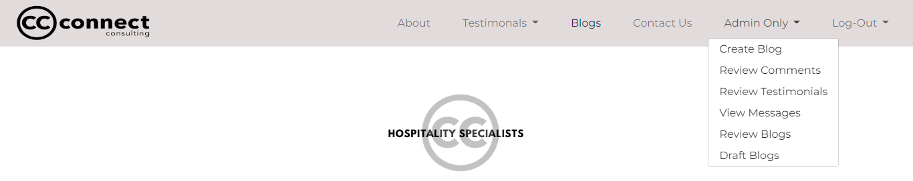
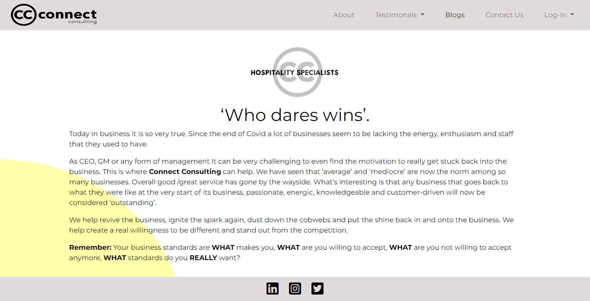

# Connect Consulting

For my **Portfolio 4 Project** on the **Code Institute's Diploma in Software Development (E-commerce Applications)** course I have created a Blog Website for a consulting Company called Connect Consulting.  

Connecting Consulting is a Consulting Company that can help clients identify their business issues, develop solutions and take remedial action.  It’s main objective is to create a meaningful impact in the lives of their clients.  What sets Connect Consulting apart is their genuine passion for helping others.  Connect Consulting connect the dots of business through people.

The website is created almost like a Wordpress Blog website where the user can create, view, edit and delete blogs on the frontend making it easier on the client and it saves on yearly subscription fees.

Link to the deployed app is [here](https://connect-consultingp4.herokuapp.com/).

-----

## Objective?

-----

The main objective is to create an interactive website that the owner as a user can engage with via an admin login system to access a database.   The website is created like a Wordpress Blog website where the user can create, view, edit and delete blogs on the frontend making it easier on the client and it saves on yearly subscription fees.   Users other than admin can login, leave comments and testimonials and read information for the blog that the owner has created, thus helping them which is the object of Connect Consulting.

## User Experience

Site Aims
1. To create a website to allow the owner to create, update and delete blogs.
1. To allow the owner/user to create, view and approve testimonials.
1. To allow the owner/user to view or delete messages from other users.
1. To allow the owner to view, approve or delete message from other users.
1. To allow users to view information about the company and the service they provide.
1. To allow users view blogs.
1. To allow users to leave comments on blogs.
1. To allow users to like a blog.

### Agile Methodology - UX

To plan this project I used agile methodology.  This was done using Github and the Project Board.

By using the Kanban board and in particular Milestones I was able to divide the project into difference epics such as:

1. Development
1. Design
1. Content
1. Authoristation
1. Comments

For better organisation I used both the Table View and Kanban view. The Kanban view meant I could put each issue into a different section, Backlog, In progress, Completed and Wishlist.

Kanban View
 

The table view allowed me to view all of the issues in each section clearly.  

Table View
 

Issues were created by way of User Stories or Admin User Stories and any other elements required to complete the database.  While working on a particular user story they were moved into ‘In progress’.  Once completed they were moved to ‘completed’.  This gave a better view of what was to be completed and what had already been completed.  As work was committed to the github repository each issue was marked completed which automatically moved to the ‘completed’ section on the Kanban Board.

### From a User's Perspective

#### Admin User's Perspective

1. As an Admin User I can login to have access to the admin panel.
1. As an Admin User I can create blogs so that users can read them.
1. As an Admin User I can delete blogs so as to control content on the website.
1. As an Admin User I can amend blogs so as to control content on the website.
1. As an Admin User I can create testimonials so that they can be view by other users.
1. As an Admin User I can view messages left by other users so that I can read them and contact them if needed.
1. As an Admin User I can approve testimonials left by the user so as to control content on the website.
1. As an Admin User I can approve or delete comments left by the user so as to control content on the website.

#### User's Perspective

1. As a user I can register or login to the website so that I can leave comments and testimonials. 
1. As a user I can enter the website and clearly see the purpose of the website and easily navigate the website.
1. As a user I can click ‘About’ and clearly see what the website is about, who owns the company and what the company offers.
1. As a user I can read Testimonials from other users that admin has approved.
1. As a user I can create Testimonials for the company which are then sent for approval.
1. As a user I can view a list of blogs created by the company so that I can choose which blog to read.  
1. As a user I can select the blog I want to view so that I can read information about that blog.
1. As a user I can leave comments on a blog so that I can provide feedback to the owner.
1. As a user I can mark a blog as favourite so that I can provide feedback to the owner.
1. As a user I can fill out a form so that I can contact the owner.
1. As a user I can logout of the website so that I can logout of the website.

## Wireframes

While the site has changed somewhat since the beginning of the project, wireframes were a useful too to visualize the website.  Wireframes below.

Wireframes
 

## Database Schema

## Site Structure 

The website consists of 16 pages.  The main pages are Home, About, Blogs, Testimonials, Contact and the Sign-up pages all of which can be accessed by all users.  Some pages are only visiable when logged in, particularly for the Admin User, such as  #### Update Blog, Delete Blog, Review Testimonials, Approve Testimonials, Review Messages and Delete Messages.  There is a comment and favourite section in the blog which can only be accessed by Admin or Users that are logged in. 

Once a user is logged in the Log-in link on the navigation bar changes to Log-Out.

Once the admin is logged in an Admin Only menu appears on the navigation bar, which only admin can view an access.

## Design

### Colours

The use of colour is to keep this as simple as possible. Clean and clear allowing the content to shine.  The use of a tint of yellow is to symbolise white wine. In future other colours may be added to symbolise red wine.  All colours are used as a gradient for some headers on the testimonials and review messages.

### Typography

Montserrat was the only font used for this website, again to keep the website, clean and simple.

## Features

### Existing Features

#### Navigation

Navigation appears on each page.  The design remains consistent throughout, however the menu options change depending of whether a user or admin user is logged in or out. 

Navigation
 

#### Home Page

This page is the landing page and is the first page that users will see when the site loads.  The page has a logo clearly showing that the website is about hospitalilty specialists.  Information about what the company do is shown on this page. 

Home Page
 

#### Footer

The footer simply directs the user to all social media links. It is consistent throughout the websiste and remains at the bottom of the page. For the purpose of this project the links will open the social media pages but not the companys social media as they are not yet set up. 

#### About

This page gives more information about the CEO of the company and goes into detail of what the company is about.  An image of the CEO is at the top of the page.  I felt it was important to put a face to the company. 

About Page
 

#### Blogs

When you click on the link on the blog page the user is directed to a list of blogs that admin have published.  The user can decide which blog to view by clicking the 'View' button which then opens up a detailed view of the choosen blog.

#### Blog Details

This page will show the blog in detail, such as Title, subtitle, images and blog content.  This page also has a comment section.  If a user is logged in they can comment on posts and like posts.  

Blog Detail
 

#### Update Blog

#### Delete Blog

#### Testimonials

#### Create Testimonials

#### Review Testimonials

#### Approve Testimonials 

#### Contact 

#### Review Messages

#### Delete Messages 

#### Sign-In

#### Sign-Up 

#### Sign-Out

Home

Home
 

-----
## Technologies Used 

- [HTML5](https://en.wikipedia.org/wiki/HTML5) to provide content and structure to the website.
- [CSS3](https://en.wikipedia.org/wiki/CSS) provides styles for the website.
- [Python](https://www.python.org/) to provide functionality to the website. 
- [a11y](https://color.a11y.com/Contrast/) to test contrast. 
- [TinyPNG](https://tinypng.com/) to compress images.
- [Cloudinary](https://cloudinary.com/) to store images. 
- [GitPod](https://www.gitpod.io/) to create and edit the website. 
- [GitHub](https://github.com/) to host website
- [GitBash](https://www.atlassian.com/git/tutorials/git-bash#:~:text=What%20is%20Git%20Bash%3F,operating%20system%20through%20written%20commands.) to push changes to GitHub.
- [Heroku](https://id.heroku.com/login) to deploy the website. 
- [Balsamiq](https://balsamiq.com/) to create wireframes. 
- [Draw.io](https://drawio-app.com/) to create logic flow chart. 
- [vsCode](https://code.visualstudio.com/) to create logic flow chart.
- [Google-Sheets](https://www.google.com/sheets/about/) to store username and scores. 
- [Google Chrome Dev Tools](https://developer.chrome.com/docs/devtools/) to debug and test responsiveness.

-----
## Resources 

- [Code Institute](https://codeinstitute.net/ie/) for course materials, tutor and mentor support, in particular the use of google sheets and deployment to heroku.
- [Slack](https://slack.com/intl/en-ie/) in particular the Code Institute Slack Community.
- [W3schools](https://www.w3schools.com/) 
- [Pexels](https://www.pexels.com/) images. 

## Python Libraries/Modules/API

-----
## Testing

### User Testing

### Manual Testing

### Validators 

Python files were tested using [Pep8 Validation](http://pep8online.com/checkresult). 

file to  Validation
 

 

###  Result: Chrome Lighthouse 

I used Chrome Lighthouse to test Performance on the website. 

Lighthouse Validation
 

 

### Color Contrast Testing 

I used [a11y](https://https://color.a11y.com/) to test the color contrast on the website

Color Contrast 
 

 

### Issues/Bugs Fixed 

**Heading**

Content 

Error

 

-----
## Version Control

### Git and GitHub 

Local repository and IDE used: GitPod
Remote repository used: GitHub

Steps followed: 
- I created a new public repository on GitHub using the Code Institute template.
- I then created a workspace and started coding on GitPod. 
- All relevant files were created. 
- To save my work safely I continued to use the terminal consistently by using: 
    - **git add .** to add work to git
    - **git commit -m""** to commit the work 
    - **git push** to update work to GitHub 

### Deployment to Heroku

The website was deployed to heroku by doing the following: 

1. Navigate to [heroku](https://id.heroku.com/login). 

2. Click "new" and create a new App. 

  

  
New App

  

  

   

3. Give your app a name, choose your region and Click "Create app". 

  

  
Name and Create

   
  

  

4. The menus that we are concerned with are "Deploy" and "Settings".  Click on "Settings" First. 

  

  
Settings

   
  

  

5. Copy the contents of the creds.json file.  Insert "CREDS" into the key field and the entire contents of the file into the value field.  The template code provided will use this information to create the file called creds.json and write this data into it as the application is built. 

  

  
Convig vars

   
  

  

6. Buildpacks now need to be added.  These install future dependancies that we need outside of the requirements file.   The first is python and the second is node.js.  Select Python first and then node.js and click save.  Make sure they are in this order.

  

  
Buildpacks

   
  

  

7. Then go to the deploy section and choose your deployment method.  To connect with github select github and confirm. 

  

  
Connect to github

   
  

  

8. Search for your repo, select it and click connect. 

  

  
Repo Search

   
  

  

9. You can choose to either deploy using automatic deploys which means heroku will rebuild the app everytime you push your changes.  For this option choose the branch to deploy and click enable automatic deploys.  This can be changed at a later date to manual.  Manual deployment deploys the current state of a branch.  

  

  
Manual Deployment

   
  

  

  

  
Automatic Deployment

   
  

  

10. Click deploy branch. 

11. If successful you should be able to view your deployed app by clicking "View". 

  

  
View Deployment

   
  

  

        
    

  ### Fork a Repository: 
        
    A copy can be made of a repository by forking the repository.  The copy can then be viewed and changed without affecting the original repository. 
    
      - From your list of repositories select the repository you want to fork.
      - On the top of the page to the right had side you will see a fork image.  Click on the button to create a copy. 

      
  

Fork Preview Image

 

  ### Clone a Repository: 
        
    Cloning this project from GitHub can be done by following these steps: 
    
      - From your list of repositories select the repository you want to deploy.
      - Click on the code tabe. 
      - Click on the clipboard icon to copy the URL.  
      - Open Git Bash in your IDE. 
      - Change the current working directory to the location you want to place the clone. 
      - Type git clone and paste the copied URL.  
      - Press enter for the clone to be created. 

  

Clone Preview Image

 

 

## Credits 

-----
## Acknowledegments/Conclusion

I couldn't complete this without the massive support I get from my Code Institute cohort in particular [Kasia](https://github.com/bezebee), our cohort facilitator.Thanks to my mentor Spencer for being a great support and a really nice guy!

Rachel Rock September 2022
